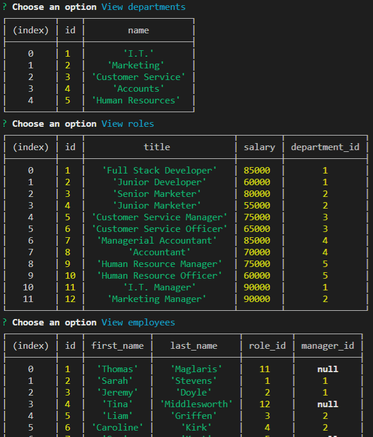

# Employee-Tracker

## Description

The following application was created to allow non-developers to simply update and view company information (role titles, role salary, employee name's etc) where the information is stored and/or updated in the form of tables through MySQL. This application was built using node, inquirer and MySQL. Simply follow the prompts to be directed in either what you would like to view or what you would like to update. 

## Table of Contents

  * [User-Story](#User-Story)

  * [Installation](#installation)

  * [Usage](#usage)

  * [Video Links](#Video-Links)

  * [Questions?](#questions)

## User-Story

As a business owner
I want to be able to view and manage the departments, roles, and employees in my company
So that I can organize and plan my business

 

## Installation
Type npm install in the terminal with the correct working directory

## Usage 
After typing 'node server.js', answer the following prompts and choose whether you would like to view any of the table information, add an employee or update it. 

## Video-Links

https://drive.google.com/file/d/10PWArDrzXnQGiPhDjLD_sw6hIc6uvOAL/view

## Questions?

  GitHub: http://github.com/thomasmaglaris
  Email: thomasmaglaris@gmail.com

Thomas Maglaris. 